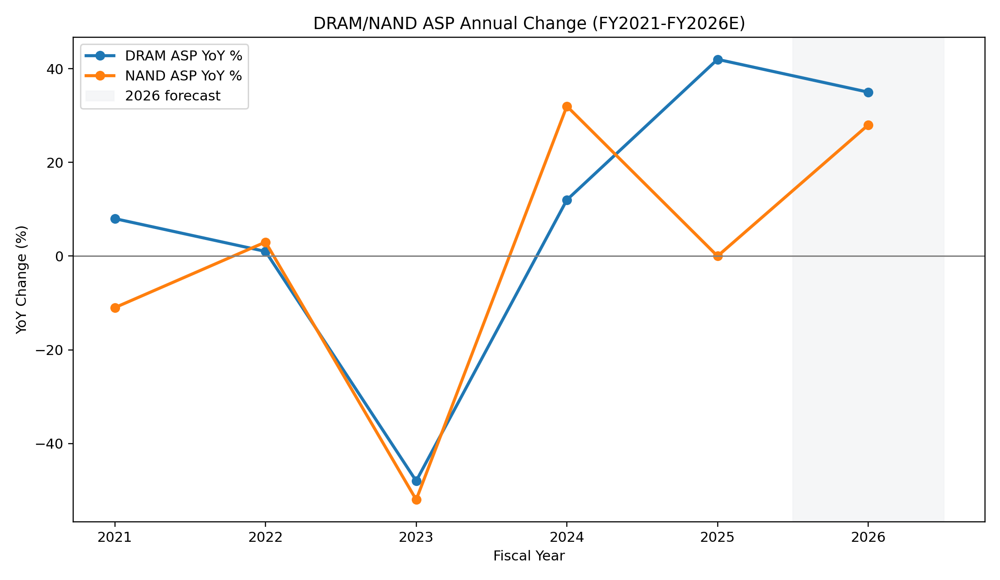
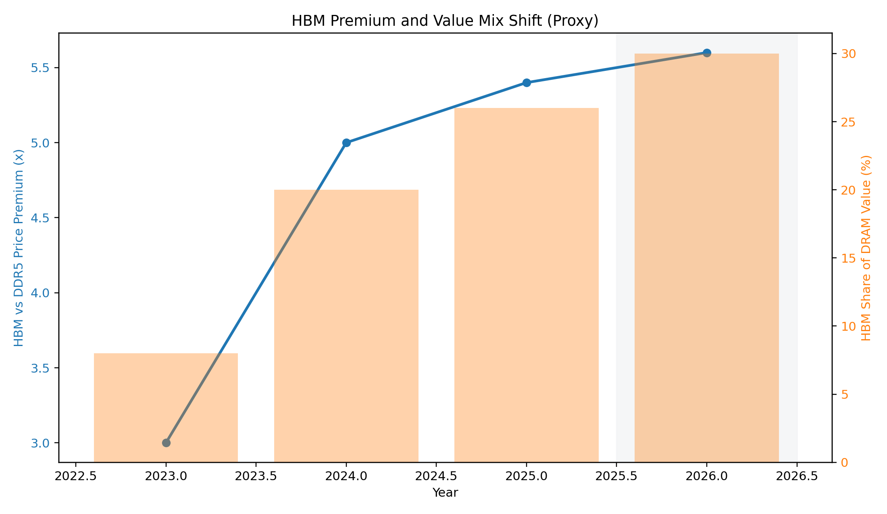
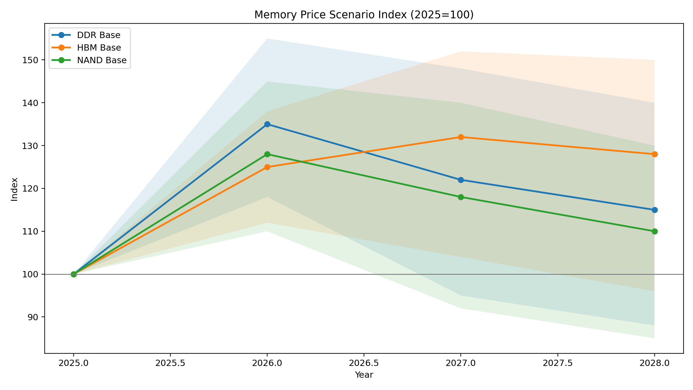

# 2026 메모리(DDR/HBM/NAND) 가격 사이클 심층 리포트
작성일: 2026-02-26  
작성 기준: 공개 자료(TrendForce, Micron SEC 10-K) + 보수적 시나리오 모델링

---

## 1) Executive Summary

지난 5년(2021~2025)의 메모리 가격은 `전형적인 공급 사이클` 위에 `AI 수요 충격`이 중첩되면서, 과거보다 진폭이 더 커진 형태로 전개됐다.

핵심만 먼저 정리하면:

1. `2021`: 팬데믹 이후 IT 수요와 공급 제약이 맞물려 DRAM은 상승, NAND는 제품 믹스 영향으로 약세.
2. `2022`: 상반기 고점 이후 재고 조정이 시작되며 하락 전환.
3. `2023`: DRAM/NAND 모두 급락(다운사이클 바닥 구간).
4. `2024`: 감산 효과와 AI 서버 수요로 반등 시작.
5. `2025`: DDR(특히 DDR4 레거시)와 NAND 계약가격이 급반등, HBM은 높은 가격 프리미엄 유지.

`결론`: 현재는 “메모리 슈퍼사이클의 중반부”라기보다, **제품별로 다른 사이클이 동시에 진행되는 분화 국면**에 가깝다.
- DDR(특히 레거시 노드): 단기 급등 이후 변동성 확대 가능성
- HBM: 구조적 고성장(단, 2026~2027 경쟁사 증설로 프리미엄 압축 리스크)
- NAND: 재고/가동률 정책에 따라 업사이드와 다운사이드가 크게 갈리는 탄력적 시장

---

## 2) 데이터 범위와 방법론

이 리포트는 `가격 절대치`와 `ASP(평균판매단가) 변화율`을 함께 본다.

- 절대치(대표 상품): TrendForce 공개 가격
  - DDR4 8Gb 1Gx8 3200 (계약가격 포인트)
  - NAND 128Gb 16Gx8 MLC (계약가격 포인트)
- 장기 추세(연간): Micron 10-K의 DRAM/NAND ASP 방향성
- HBM: 공개된 절대 시계열이 제한적이므로,
  - DDR5 대비 가격 프리미엄(배수)
  - DRAM 가치 내 HBM 비중
  두 축으로 추정

주의:
- 2026년 수치 일부는 `실적 확정치`가 아닌 `전망치(시나리오)`다.
- HBM의 2021~2022 절대가격 공개 데이터는 제한적이므로 `N/A` 구간이 존재한다.

---

## 3) 최근 5년 히스토리: 무엇이 어떻게 바뀌었나

### 3-1. 연간 ASP 변화율(핵심)

해석:
1. `2023 급락`이 최근 5년의 바닥을 형성했다.
2. `2024~2025 회복`은 단순 재고 정상화가 아니라, AI 서버 중심의 메모리 구성 변화(HBM 믹스 확대)와 동행했다.
3. 2026은 상반기 강세 시그널이 강하지만, 하반기에는 가격 탄력 둔화 가능성을 함께 봐야 한다.

연간 변화율 데이터(요약):
- DRAM ASP: 2021 +8%, 2022 +1%, 2023 -48%, 2024 +12%, 2025 +42%, 2026E +35%
- NAND ASP: 2021 -11%, 2022 +3%, 2023 -52%, 2024 +32%, 2025 0%, 2026E +28%

여기서 2026E는 TrendForce의 분기별 가격 가이던스를 기반으로 한 보수적 중앙값이다.

---

### 3-2. 연도별 내러티브

#### 2021: 공급 제약 + 수요 강세
- DRAM은 타이트한 수급으로 ASP가 상승.
- NAND는 수요는 견조했지만 제품 믹스/경쟁 강도 영향으로 DRAM 대비 약세.

#### 2022: 고점 통과 후 급격한 정상화
- 고객사 재고가 높아지며 구매 패턴이 보수화.
- 하반기부터 감산 논의가 본격화.

#### 2023: 다운사이클 심화
- DRAM/NAND 모두 ASP 급락.
- 주요 업체 감산과 CAPEX 조정이 진행.

#### 2024: 바닥 통과, 회복 신호
- 감산 효과가 누적되고 재고 정상화가 진행.
- AI 서버가 HBM 수요를 구조적으로 밀어 올리기 시작.

#### 2025: “슈퍼사이클” 체감 구간
- DDR4 레거시 제품군과 NAND 계약가격 급반등.
- HBM은 높은 프리미엄을 유지하며 공급 부족이 지속.

---

## 4) 제품군별 가격 변화

### 4-1. DDR (DRAM)

대표 가격 포인트(USD, 계약 기준):
- DDR4 8Gb 1Gx8 3200
  - 2025-03: 1.951
  - 2025-07: 3.90
  - 2025-12: 9.30
  - 2026-01: 11.50

이 구간은 매우 이례적인 기울기다. 특히 2025 하반기~2026 초의 급등은:
1. 레거시 공정 공급 타이트닝
2. 서버/PC 재고 재축적
3. 전략 재고 확보 수요
가 겹친 결과로 해석된다.

다만 중요한 점은, 이런 속도의 상승은 `지속성`보다 `변동성`을 동반하는 경우가 많다는 것이다. 즉, 가격 레벨이 높아질수록 수요 파괴(demand destruction)와 대체 효과가 나타날 수 있다.

---

### 4-2. NAND Flash

대표 가격 포인트(USD, 계약 기준):
- NAND 128Gb 16Gx8 MLC
  - 2025-03: 2.51
  - 2025-07: 3.39
  - 2025-12: 5.738

NAND는 구조적으로 `가동률/재고 정책`의 영향이 매우 크다.
- 공급사들이 감산을 완화하면 탄력적으로 공급이 복구된다.
- 반대로 공격적 증설 없이 수요만 붙으면 가격 반등 폭이 확대된다.

2025의 반등은 강했지만, NAND는 DRAM/HBM 대비 진입장벽이 상대적으로 낮고 공급 반응 속도가 빠르기 때문에, `상승 추세의 경사`가 가장 빨리 완만해질 가능성이 있다.

---

### 4-3. HBM

HBM은 최근 5년 메모리 시장에서 가장 중요한 구조 변화다.

핵심 포인트:
1. `가격 프리미엄`: HBM은 DDR5 대비 다배수 프리미엄을 유지(2024년 약 5배 수준, 공개 코멘트 기준).
2. `가치 비중 확대`: DRAM 내 HBM 가치 비중이 급상승.
3. `공급 제약`: TSV, 패키징, CoWoS 등 후공정 병목이 가격 지지 요인으로 작동.

하지만 2026~2027에는 두 가지가 동시에 전개될 수 있다.
- 수요 강세 지속(AI 가속기 세대 교체)
- 경쟁사 증설로 프리미엄 일부 압축

즉, HBM은 여전히 성장 축이지만, 2025와 동일한 강도의 “초과이익 확장”은 점진적으로 둔화될 수 있다.

---

## 5) 향후 전망 (2026~2028): Base/Bull/Bear

(지수 기준: 2025=100)

### 5-1. Base 시나리오
- DDR: 2026 고점 형성 후 2027~2028 완만 조정
- HBM: 2026~2027 추가 상승, 2028 안정화
- NAND: 2026 반등 이후 2027~2028 보합~약조정

핵심 가정:
1. AI 서버 수요는 유지되지만 성장률은 점진 둔화
2. 공급사 증설은 진행되나 급격한 오버슈트는 제한
3. 거시경제 침체는 발생하지 않음

### 5-2. Bull 시나리오
- AI Capex가 예상보다 길게 고성장 유지
- HBM 수율/패키징 병목이 장기화
- DDR/NAND도 동반 강세 연장

### 5-3. Bear 시나리오
- 클라우드 투자 사이클이 조기 둔화
- 공급 증설이 수요보다 빠르게 반영
- 지정학/환율 충격으로 재고 조정 재개

---

## 6) 투자/산업 관점 시사점

1. `단일 메모리 뷰는 위험`  
   이제는 “메모리 전체”보다 `DDR/HBM/NAND를 분리`해 봐야 한다.

2. `HBM은 성장주, DDR/NAND는 사이클주 성격`  
   HBM은 구조 성장의 성격이 강하고, DDR/NAND는 재고-가동률-가격의 전통 사이클 영향이 크다.

3. `가격보다 믹스가 더 중요`  
   동일 매출 성장이라도 HBM 비중이 높은 업체가 수익성 방어에 유리하다.

4. `체크해야 할 선행지표`  
   - AI 서버 출하 및 GPU 로드맵
   - CoWoS/TSV 증설 속도
   - 주요 메모리 업체 재고일수(DIO)
   - 고객사 장기계약 전환 비중

---

## 7) 리스크 요인

1. `정책/규제`: 대중국 수출규제 강화 시 제품별 수요 재편 가속
2. `기술 전환`: HBM 세대 전환 속도 차이로 업체간 가격 협상력 격차 확대
3. `거시환경`: 금리/환율/IT 소비 둔화가 DDR/NAND 현물 심리에 즉시 반영
4. `공급 오버슈트`: HBM 공급 확장이 예상보다 빠르면 프리미엄이 급격히 축소될 수 있음

---

## 8) 결론

“반도체 슈퍼사이클”이라는 표현은 방향성으로는 맞지만, 실제 시장은 `제품별로 다른 속도`로 움직이고 있다.

- DDR: 2025~2026 급등 이후 변동성 구간 진입 가능성
- NAND: 공급 정책에 가장 민감한 탄력 구간
- HBM: 구조적 성장축 유지, 다만 2026~2027부터 프리미엄 압축 여부가 핵심 분기점

따라서 향후 12~24개월의 핵심 질문은 하나다.
`“수요가 둔화되는가?”`보다 `“공급이 얼마나 빨리 정상화되는가?”`

메모리 가격의 방향 자체보다, **제품 믹스(특히 HBM 비중)와 공급반응 속도**가 성과를 좌우할 가능성이 가장 높다.

---

## 부록 A) 사용 데이터 파일

- `annual_asp_change.csv`
- `representative_price_points.csv`
- `hbm_premium_and_share.csv`
- `forecast_scenarios_index.csv`

---

## 부록 B) 주요 출처 (원문 링크)

### 가격/시장 데이터
- TrendForce DRAM Price: https://www.trendforce.com/price/dram/
- TrendForce Flash Price: https://www.trendforce.com/price/flash/
- TrendForce (1Q26 DRAM/NAND 전망): https://www.trendforce.com/presscenter/news/20260109-12689.html
- TrendForce (HBM/AI 메모리 구조 변화): https://www.trendforce.com/news/2024/03/19/news-ai-reinvents-memory-industry-hbm-demand-boom-expected-revenue-growth-in-2024/
- TrendForce (HBM 향후 가격/공급 전망): https://www.trendforce.com/news/2025/11/11/news-hbm-set-for-rapid-growth-in-2026-but-faces-potential-oversupply-risks-by-2027-trendforce-reports/

### 기업 공시 (ASP 방향성)
- Micron FY2023 10-K (filed 2023-10-12): https://www.sec.gov/ixviewer/ix.html?doc=/Archives/edgar/data/723125/000072312523000084/mu-20230831.htm
- Micron FY2024 10-K (filed 2024-10-10): https://www.sec.gov/ixviewer/ix.html?doc=/Archives/edgar/data/723125/000072312524000068/mu-20240829.htm
- Micron FY2025 10-K (filed 2025-10-09): https://www.sec.gov/ixviewer/ix.html?doc=/Archives/edgar/data/723125/000072312525000056/mu-20250828.htm

---

## 부록 C) 해석 시 유의사항

1. 본 리포트는 투자권유가 아니다.
2. 일부 2026~2028 값은 시나리오 모델이며 확정치가 아니다.
3. HBM 절대가격 장기 시계열은 공개 데이터 제약이 있어, 프리미엄/믹스 접근을 병행했다.
