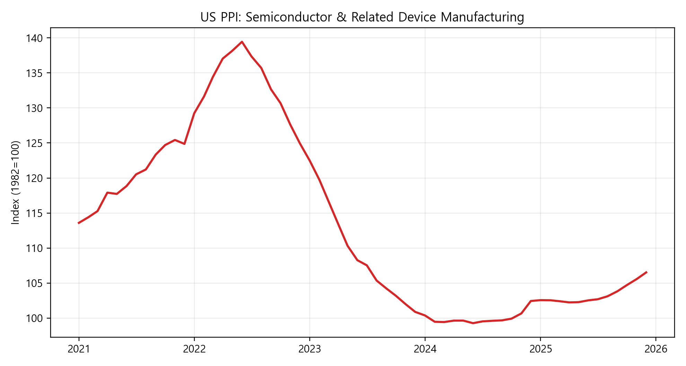
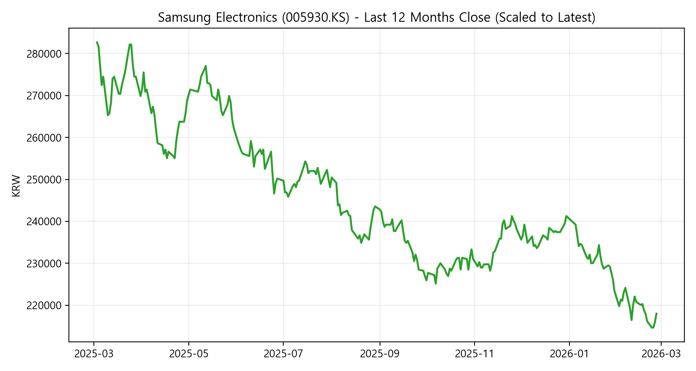
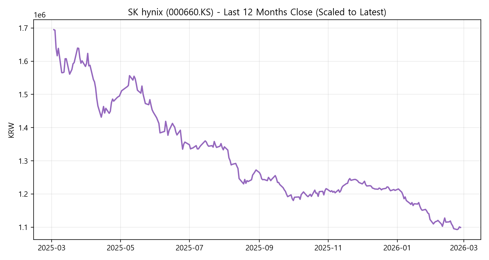
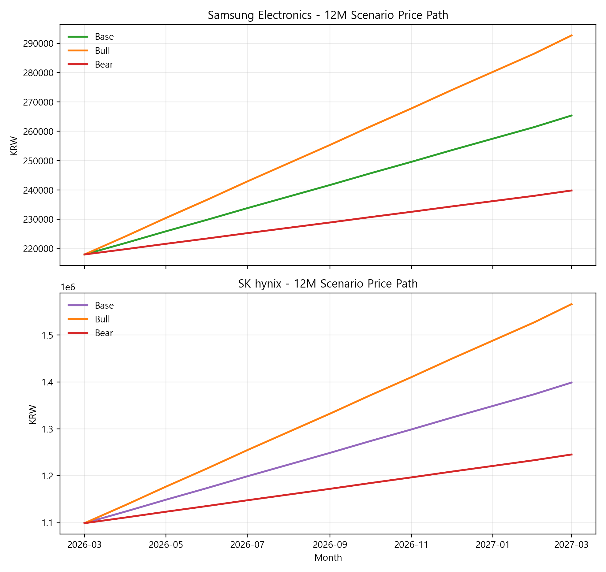

# 삼성전자·SK하이닉스 주가 전망 리포트 (12개월)
작성일: 2026-02-27

본 리포트는 **메모리 가격 전망(DDR/HBM/NAND) 기반**의 시나리오 모델로 삼성전자와 SK하이닉스의 **향후 12개월 주가 범위**를 추정합니다.

---

## 1) Executive Summary
- **메모리 가격의 사이클 상향 전환**이 2026년 수익성의 핵심 변수입니다.
- **HBM 믹스/프리미엄 확대**의 수혜 강도는 **SK하이닉스 > 삼성전자**로 가정했습니다.
- 기준 시나리오 기준 12개월 목표가(대략치):
  - **삼성전자**: 265,400원 (현재가 218,000원 기준)
  - **SK하이닉스**: 1,398,700원 (현재가 1,099,000원 기준)

> 주의: 본 문서는 예측 모델 시뮬레이션이며 투자 권유가 아닙니다.

---

## 2) 데이터 및 방법
**입력 데이터**
- 메모리 가격 전망: `forecast_scenarios_index.csv` (2026년 DDR/HBM/NAND 시나리오 인덱스)
- HBM 프리미엄/믹스: `chart_3_hbm_premium_mix.png`
- DDR/NAND 계약 가격 포인트: `chart_2_contract_price_points.png`
- 외부 지표: USD/KRW, 반도체 PPI
- 주가 데이터: Yahoo Finance 지연시세
  - 삼성전자(005930.KS): 218,000원, 2026-02-27 15:30:03 GMT+9
  - SK하이닉스(000660.KS): 1,099,000원, 2026-02-27 15:30:14 GMT+9

**모델 구성(요약)**
- 2026년 시나리오 인덱스를 이용해 **메모리 가격 종합지수**를 계산.
- 종합지수 변화를 **주가 민감도(beta)**로 환산.
- 산식:
  - `목표가 = 현재가 × (1 + beta × (메모리종합지수-100)/100)`

**가정(민감도/가중치)**
- 삼성전자: DDR 50% / HBM 15% / NAND 35%, beta 0.70
- SK하이닉스: DDR 50% / HBM 40% / NAND 10%, beta 0.90

---

## 3) 메모리 가격 전망(내부 리포트 기반)

---

## 4) 외부 연관 지표

---

## 5) 최근 12개월 주가 흐름
> 참고: 12개월 추이는 제공된 로컬 시계열을 사용하고 **최신 종가 기준으로 레벨을 스케일 보정**했습니다.

---

## 6) 12개월 주가 시나리오 결과

### 6-1. 목표가 요약 (12개월)

| 종목 | 현재가 (2026-02-27 기준) | Bear | Base | Bull |
|---|---:|---:|---:|---:|
| 삼성전자 | 218,000 | 239,800 | 265,400 | 292,700 |
| SK하이닉스 | 1,099,000 | 1,245,400 | 1,398,700 | 1,565,900 |

---

## 7) 리스크 체크포인트
- **가격 급등 이후 수요 둔화** (PC/모바일 ASP 저항)
- **HBM 공급 제약/수율 이슈** (HBM 프리미엄 유지 여부)
- **환율 변동성** (원/달러 급등 시 원화 매출 민감도 확대)
- **CAPEX 재확대** (2026 하반기 공급과잉 가능성)

---

## 8) 결론
- **SK하이닉스**는 HBM 비중 확대로 **메모리 사이클 상향 국면의 레버리지**가 큼.
- **삼성전자**는 메모리 회복 수혜가 있으나 **비메모리/모바일 사업 변수**의 완충 효과가 존재.
- 12개월 전망은 **메모리 가격 경로와 HBM 믹스**가 핵심 변수.

---

### 참고 및 면책
- 본 문서는 교육/리서치 목적이며, 투자 판단의 최종 책임은 사용자에게 있습니다.
